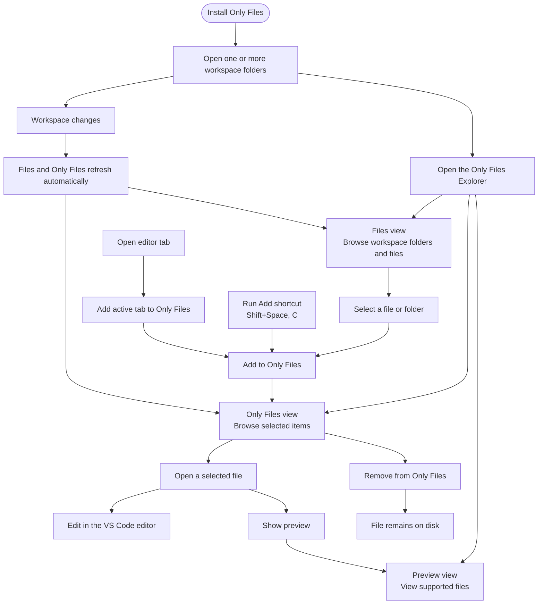

# Only Files 📂💗

<h3 style="margin-top: 0.1em; margin-bottom: 0.4em;"><em>Use only files that you really need!</em></h3>

##   

#### Wasting too much time looking for a file or folder among a ton of files and directories? **Only Files** helps you work with only the ones you need right now.

##
>#### ***Only Files** keeps your focus strictly on the files and folders you add to the view while preserving their original hierarchy. It automatically updates when you change the structure or manipulate files and it fully supports drag-n-drop.*
>#### 🎯 *It is the perfect choice if you want a clean productive environment that saves valuable screen space in VS Code.*

## What the extension can do?
### Only Files - **3** views you can manage:
  - #### **<a href="#folder-view--files">Folder View</a>**: this *[treeview](https://code.visualstudio.com/api/extension-guides/tree-view)* replicates the standard Explorer view but adds enhanced capabilities and a streamlined short context menu, also making project navigation much easier.
  - #### **<a href="#only-files-view--only">Only Files View</a>**: this *[treeview](https://code.visualstudio.com/api/extension-guides/webview)* displays only the items you manually add to it. So it behaves like a container. It includes advanced features and turns it into a comfortable tool for managing your projects.
  - #### **<a href="#preview-view">Preview View</a>**: a *[webview](https://code.visualstudio.com/api/extension-guides/webview)* that lets you load and preview HTML, PDF, TXT, LOG and MD files. It fully supports zooming and drag-n-drop.

## ✨Key Features
### `Folder View`  (**FILES**)
<table width="100%" cellpadding="0" cellspacing="0">
  <tr id="ignore_files_table">
    <td width="40%" valign="top">
    🔸Switching <u>ON</u> <b><i>use ignore-files</i></b> hides the folders and files listed in your chosen ignore-file.
    </td>
    <td valign="top" rowspan="3">
      
    </td>
  </tr>
  <tr id="plain_view_table">
    <td valign="top">
    🔸Switching <u>ON</u> <b><i>plain view</i></b> shows all folder and file names as paths relative to the workspace folder. Once <u>ON</u> you can <b><i>uncollapse</i></b> any folder.
    </td>
  </tr>
  <tr id="uncollapse_all_table">
    <td valign="top">
    🔸<b><i>Uncollapsing all to plain view</i></b> switches <u>ON</u> <b><i>plain view</i></b>, displaying all files decoupled from their folders.
    </td>
  </tr>
</table>

### `Only Files View`  (**ONLY**)
<table width="100%" cellpadding="0" cellspacing="0">
  <tr>
    <td width="34%" valign="top">
    🔹Drag-n-drop or inline <b><i>Send to Only Files</i></b> sends an item or selected items with its content to this view from anywhere.
    </td>
    <td valign="top" rowspan="3">
      
    </td>
  </tr>
  <tr>
    <td valign="top">
    🔹Drag-n-drop from this view or inline <b><i>Remove from Only Files</i></b> removes the item with its content from the view.
    </td>
  </tr>
  <tr id="marked_items_table">
    <td valign="top">
    🔹<b><i>Marked</i></b> items can be used anytime you want to collect them here.
    </td>
  </tr>
</table>

### `Preview View`
<table width="100%" cellpadding="0" cellspacing="0">
  <tr>
    <td width="36%" valign="top">
    &nbsp;⬥ Drag-n-drop-with-Shift or inline <b><i>Preivew in Only Files</i></b> sends an item from <b><i>Only Files View</i></b> to be previewed.
    </td>
    <td valign="top" rowspan="3">
      
    </td>
  </tr>
  <tr>
    <td valign="top">
    &nbsp;⬥ <b><i>Preivew in Only Files</i></b> context menu item does the same from anywhere. The view preserves its state.
    </td>
  </tr>
  <tr>
    <td valign="top">
    &nbsp;⬥ Holding <b>Ctrl</b> by using scroll changes zoom, holding <b>Shift</b> - scrolls horizontally. Context menu shows file name and options.
    </td>
  </tr>
</table>

### **Specs**
- #### All Built-in Explorer-like feautures, e.g. *rename*, *copy*, *delete*, *cut*, *paste* are supported in both treeviews.

- #### All changes made in your workspace are reflected in the `Folder` and `Only Files` views in real time.

- #### Rename file from the opened tab is supported.

- #### Context menu call on an empty `Preview` suggests to open its settings.

- #### Context menu call on a non-empty `Preview` suggests to open *Tip*.

- #### *Tip* suggests to open *hot keys* and *all commands*.

- #### The item changes its label color during renaming.

- #### Use 🤖 [commands](#keyboard-shortcuts):

  - Rename file/folder: `F2`
  - Rename opened file: `Shift+F2`
  - Send/Add from the Explorer, an editor tab, or a selected tree item:
    `Shift+Space`, then `C` (macOS: `Shift+Space`, then `C`)
  - Remove from an editor tab or selected tree item:
    `Shift+Space`, then `X` (macOS: `Shift+Space`, then `X`)
  - Preview the selected file or active editor:
    `Shift+Space`, then `V`
  - Refresh the `Files` view: `Shift+Space`, then `A`
  - Refresh the `Only Files` view: `Shift+Space`, then `Z`
  - Switch between classic and plain views: `Shift+Space` twice

 

## 📽️Demo
### How to use

### All in one

 

## 📑Menu
<table width="100%" cellpadding="0" cellspacing="0">
  <tr>
    <td>
      
    </td>
    <td>
      
    </td>
    <td>
      
    </td>
  </tr>
</table>

### Notes
- #### The <u>currently active view</u> displays a green magnifier icon &nbsp;
 (indicating which treeview is controlling the file system at the moment)
- #### Magnifier icon button is used for a *list search*.
- #### [Uncollapsed folders](#plain_view_table) have background tint and they cannot be added to `Only Files View`.
- #### Uncollapsing every folder in the `Folder View` gives you the same [effect](#plain_view_table) as [*Uncollapse All to Plain*](#uncollapse_all_table) has.
- #### Since [*Uncollapse All to Plain*](#uncollapse_all_table) and __*Reveal References*__ are highly time-consuming tasks the extension suggests to specify a [gitignore](https://git-scm.com/docs/gitignore) file to exclude irrelevant folders from the target operative scope if needed.
- #### __*Show All Possible Files*__ resets all top-level folders in the `Only Files View` to the state like they were freshly added.
- #### __*Show only This One*__ removes the top-level folder of a target item from `Only Files View` and add exactly that item to this view.
- #### An item removed from the `Only Files View` is highlighted in orange if its parent folder is still present. This can be disabled in settings.
- #### __*Refreshing*__ `Only Files View` toggles the sorting order: green colored icon indicates that items are sorted by their base names instead of their file paths; refreshing again restores the original order and reloads displayed items from the file system; it also switches to [*plain view*](#plain_view_table) if it is <u>ON</u>.
- #### The extension provides a fallback system for file operations: if VS Code cannot complete an [operation](https://code.visualstudio.com/api/references/vscode-api#WorkspaceEdit), the extension tries to achieve the goal in a more [aggresive way](https://code.visualstudio.com/api/references/vscode-api#workspace.fs) and warns the user.
- #### *Single click* selects the item, *fast double click* opens; *slow double click* opens autopick item rename dialog.
- #### Via the settings the user can manage the built-in autopick dialog time, click and rename time; the user can enable/disable showing empty or uncollapsed folders.
- #### The user can change default Postfix in the file name used by __*Duplicate*__.

 

## ⚡Keyboard Shortcuts
#### Be sure to explore all the [commands](https://code.visualstudio.com/api/extension-guides/command) and [shortcuts](#tip-suggests-to-open-hot-keys-and-all-commands) available to you!
#### The extension uses the following default shortcuts.
`Ctrl` is mapped to `Cmd` on macOS. **Send(Add)**/**Remove** chords intentionally use `Shift+Space` on both platforms.

| Action | Windows/Linux | macOS |
| --- | --- | --- |
| Rename selected item | `F2` | `F2` |
| Rename active tab | `Shift+F2` | `Shift+F2` |
| Delete selected item | `Delete` | `Delete` |
| Permanently delete selected item | `Shift+Delete` | `Shift+Delete` |
| Copy selected item | `Ctrl+C` | `Cmd+C` |
| Cut selected item | `Ctrl+X` | `Cmd+X` |
| Paste into a view | `Ctrl+V` | `Cmd+V` |
| Copy file path | `Ctrl+Shift+C` | `Cmd+Shift+C` |
| Send item | `Shift+Space`, then `C` | `Shift+Space`, then `C` |
| Remove item | `Shift+Space`, then `X` | `Shift+Space`, then `X` |
| Preview item | `Shift+Space`, then `V` | `Shift+Space`, then `V` |
| Refresh `Files` | `Shift+Space`, then `A` | `Shift+Space`, then `A` |
| Refresh `Only` | `Shift+Space`, then `Z` | `Shift+Space`, then `Z` |
| Switch classic/plain mode | `Shift+Space` twice | `Shift+Space` twice |

 

## Contribution
>### Contributions are welcome! 🙏 Feel free to take part in the extension evolving, ask question, open issue and discuss.
### Whether you are fixing a bug, adding a feature, or improving documentation, here is how you can get involved:

### 1. Reporting Bugs & Feature Requests
- Check the **Issues** tab to see if your topic is already being discussed.
- If not, open a new issue. Please include clear steps to reproduce bugs, or a detailed description for new features.

### 2. Making Changes
1. **Fork** the repository.
2. Create a new branch for your feature or fix: `git checkout -b feature/your-feature-name`.
3. Make your changes and commit them with clear messages.
4. Ensure your code follows the existing project style and that all tests pass if possible.

### 3. Submitting a Pull Request
- Open a **Pull Request (PR)** against the `main` branch.
- Describe your changes clearly in the PR description.
- Wait for review! I will look over your code and suggest changes if needed.

#### <u>Thank you for helping make this project better!</u>

 

## Misc
<table cellpadding="0" cellspacing="0">
  <tr>
    <td valign="top">
      Theme used in the examples: <b><a href="https://github.com/maxoiduss/dark-synthwave-84">Dark SynthWave</a></b>
    </td>
    <td valign="bottom">
      
    </td>
  </tr>
</table>

## Changelog
&nbsp;&nbsp;&nbsp;[LOG](CHANGELOG.md)

## License
&nbsp;&nbsp;&nbsp;[MIT](LICENSE.md)
