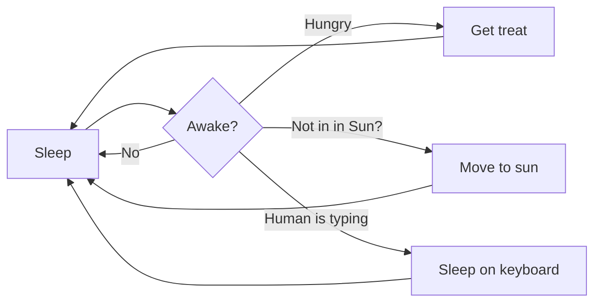

# Only Files
## _Use only the files you need!_ 🤠📁

Avoid wasting time looking for a file among a large number of files or directories. Only Files helps you to select only the ones you need.

## How does it work?
- Install the extension
- Open one or more folders in your workspace
- Open the Only File Explorer
- Two views are displayed: Files and Only Files
  - `Files` displays all your files from workspace
  - `Only Files` displays the files you selected to be displayed
- Add files to Only Files (review <a href="#addFiles">Add files section</a>):
  - In your explorer, right click on item and click on 'Add to Only Files'
  - In Files view, click on show icon for add the file to Only Files view
  - In tab, right click on item tab and click on 'Add to Only Files'
  - Use the command `"cmd"+"y"`
- In Only Files, you can open the files. If you want to remove from the view click on hide icon
- ✨ Enjoy your files ✨

## Common terms

- **Workspace**: The folder or set of folders currently open in VS Code.
- **Explorer**: The VS Code area that shows the folders and files in your workspace.
- **Files view**: The Only Files view that displays the files available in your workspace.
- **Only Files view**: The focused list of files you selected for quick access.
- **Tab**: An open editor tab in VS Code.
- **Add**: Put a file into the Only Files view without moving it on disk.
- **Remove**: Take a file out of the Only Files view without deleting it.
- **Command**: An action that can be run from the Command Palette or a keyboard shortcut.

## Demo

## Views

## 
Add files

Apart of using the icons, you have many options for add or remove files from Only Files View:

- Add files from Explorer

- Select multiple files and select the menu (You can click on one icon too):

- From tab menu:

- Use commands:

  - Add: `"cmd"+"y"`

  - Remove: `"cmd"+"alt"+"y"`

All changes made in your workspace will be reflected in `Files` and `OnlyFiles` views in real time 🚀
## License

MIT
